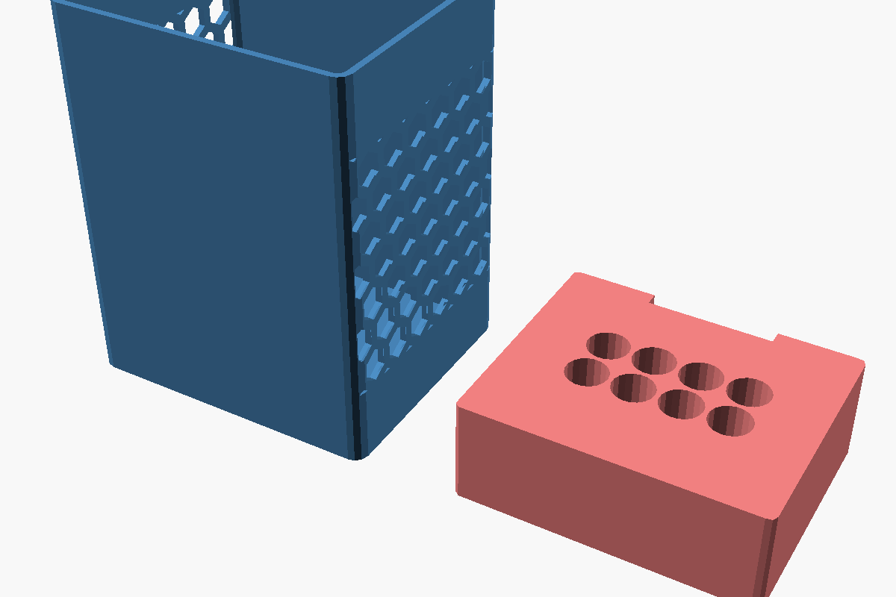

# container

- **Local path:** [./container/](./container/)
- **Author:** John Mylchreest <jmylchreest@gmail.com>
- **License:** [MIT](./container/LICENSE)

Parametric box with per-face layered styles (solid, hex perforation, grid)
and arbitrary cut operations. Companion `insert()` sized from the same
top-level dimensions so the two stay in sync.

## What it provides

### `container(width, depth, height, wall, corner_r, open_top, closed_bottom, rim_thickness, faces, cuts)`

Box origin at the back-left-bottom corner; +X width, +Y depth (back → front),
+Z height.

- `faces = [[face_name, [layers]], …]` — layered styles per face. Face names
  are `"back"`, `"front"`, `"left"`, `"right"`, `"bottom"`, `"top"`. Each
  layer is `[style, z_from, z_to, params]`.
- `cuts = [[face_name, cut_type, params], …]` — subtractive ops (e.g. a
  handle slot on the front).

### `insert(container_width, container_depth, container_wall, …)`

Tray sized from the container's outer dimensions; passes the same top-level
vars and you never have to sync manually.

- `width` / `depth` — override the default (interior − 2 × clearance) so
  multiple inserts can share one container.
- `pos_x` / `pos_y` — offset from the container's interior centre.
- `corner_radii = [fl, fr, bl, br]` — per-corner radius; 0 keeps a corner
  sharp where two inserts share an edge.
- `cell_depth` — pocket depth from the top. Default = full open pocket.
- `finger_slot_side = "none" | "back" | "front" | "both"` — finger slots;
  "both" keeps multi-insert layouts symmetric.

## Panel styles

| Style | Params (positional) | Notes |
|---|---|---|
| `"solid"` | (none) | No-op — no cutout |
| `"hex"` | `[cell_size, wall_thickness, margin]` | Honeycomb perforation |
| `"grid"` | `[hole_diameter, pitch]` | Square grid of round holes |
| `"slot"` (cut only) | `[center_x, width, z_from, z_to, corner_r]` | Vertical rectangular cutout |

## Preview

A demo container with hex-perforated side walls (solid base + hex band + solid top) and a matching pen insert sized from the same dimensions.



## Keeping the insert in sync with the container

Easiest pattern: keep the variant in **one** `.scad` file and pick which artefact to render with a top-level switch.

```openscad
use <libraries/container/container.scad>

render_target = "container";  // [container, insert_pens, insert_usb]

container_width  = 90;
container_depth  = 75;
container_height = 115;
wall_thickness   = 2;

if (render_target == "container") {
    container(width = container_width,
              depth = container_depth,
              height = container_height,
              wall = wall_thickness);
} else if (render_target == "insert_pens") {
    insert(container_width = container_width,
           container_depth = container_depth,
           container_wall  = wall_thickness,
           height = 30,
           cells  = [4, 2, "round", 12],
           finger_slot_side = "back");
}
```

The container's outer dimensions and `wall_thickness` are the only numbers the insert needs — no separate spec object, no manual sync.

## Multiple inserts in one container

```openscad
// Two inserts splitting the container 50/50 along X, with their shared
// inside edge perfectly flat.
insert(container_width = 90, container_depth = 75, container_wall = 2,
       width = 42, pos_x = -22,
       corner_radii = [2, 0, 2, 0],   // right edge sharp
       cells = [2, 2, "round", 12]);

insert(container_width = 90, container_depth = 75, container_wall = 2,
       width = 42, pos_x = +22,
       corner_radii = [0, 2, 0, 2],   // left edge sharp
       cells = [3, 2, "rect", 13, 6, 1.2]);
```
