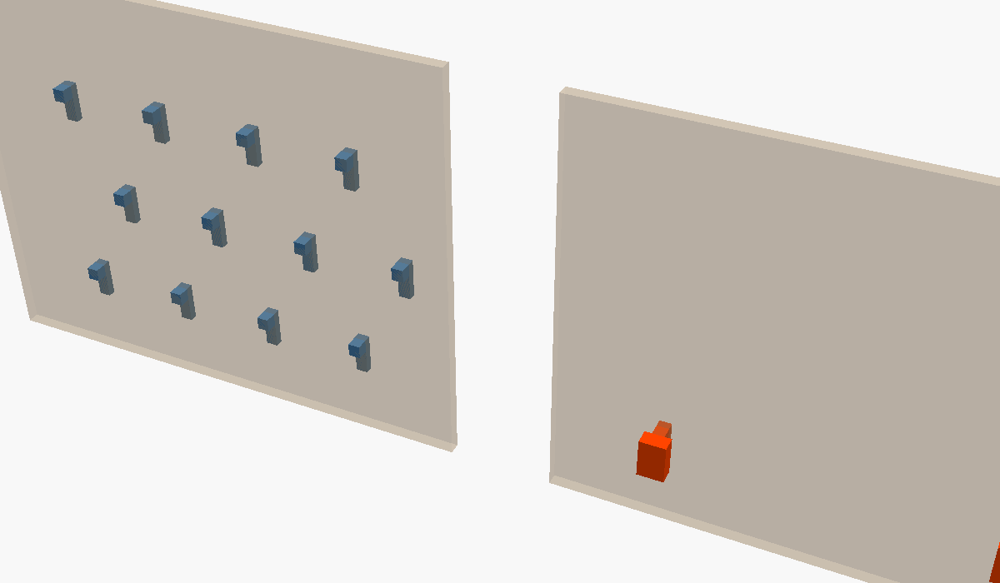

# ikea-skadis

- **Local path:** [./ikea-skadis/](./ikea-skadis/)
- **Author:** John Mylchreest <jmylchreest@gmail.com>
- **License:** [MIT](./ikea-skadis/LICENSE)

Parametric primitives for the IKEA SKÅDIS pegboard — a surface-agnostic peg
plus a staggered-grid placer matching the real board (two interlocking 40×40 mm
grids offset by 20 mm, slots 5 × 15 mm).

## What it provides

- `skadis_peg(standoff, retainer, tol_w, tol_h, standoff_top_ext,
  standoff_bot_ext, …)` — one peg. Origin = slot centre on the panel front;
  geometry exists only at Y ≥ −standoff, so the parent can be any thickness.
  `standoff_top_ext` / `standoff_bot_ext` flare the parent-side end of the
  standoff block into a bracket shape (both 0 = rectangular).
- `skadis_peg_grid(cols, rows, anchor, vanchor, max_w, max_h, include, skip,
  stagger, standoff, standoff_top_ext, standoff_bot_ext, retainer, tol_*, …)`
  — staggered rectangular grid. Whitelist sparse layouts with
  `include = [[c, r], …]` or `skip = [[c, r], …]`.
- `skadis_pegs_at(positions, …)` — explicit list of `[col, row]` indices on
  the same staggered grid.
- `skadis_pegboard_preview(width, height, …)` — translucent slab for
  alignment checks in `$preview`. Never enters the STL.
- Helpers: `skadis_peg_x`, `skadis_peg_z`, `skadis_grid_w/h`,
  `skadis_cols_for_width`, `skadis_rows_for_height`, `skadis_row_stagger`,
  `skadis_anchor_z_offset`.
- Accessors for the constants (`skadis_slot_w()`, `skadis_pitch_x()`, …) so
  user code can read them through `use<>` (variables aren't imported).

## Mechanical constants

| Constant | Value | Meaning |
|---|---|---|
| `SKADIS_SLOT_W`     | 5.0 mm  | Slot horizontal width |
| `SKADIS_SLOT_H`     | 15.0 mm | Slot vertical height |
| `SKADIS_PITCH_X`    | 40.0 mm | Horizontal pitch within a row |
| `SKADIS_PITCH_Y`    | 20.0 mm | Vertical pitch between rows |
| `SKADIS_PANEL_T`    | 5.5 mm  | Panel thickness (measured; IKEA spec is 5) |
| `SKADIS_PANEL_TOL`  | 0.2 mm  | Tab overshoots panel by this much |
| `SKADIS_DROP`       | 10.0 mm | Lock travel (= slot_h − tab_h) |
| `SKADIS_TAB_H`      | 5.0 mm  | Tab Z height |
| `SKADIS_RETAINER_H` | 12.5 mm | Back retainer Z height |
| `SKADIS_RETAINER_D` | 3.0 mm  | Back retainer Y depth |
| `SKADIS_STANDOFF_W` | 10.0 mm | Standoff block X width |
| `SKADIS_STANDOFF_H` | 15.0 mm | Standoff block Z height |

Any of these can be overridden per call on `skadis_peg` / `skadis_peg_grid` /
`skadis_pegs_at` (`slot_w`, `slot_h`, `panel_t`, `panel_tol`, `tab_h`, `ret_h`,
`ret_d`, `standoff_w`, `standoff_h`) — `undef` uses the library default.

## Lock mechanism

5 mm tab + 12.5 mm back retainer behind the panel. Insert with the tab at the
slot top, drop 10 mm — the retainer's 7.5 mm tail then sits behind solid
panel below the slot, locked by gravity. To remove, lift 10 mm and pull.

## Preview

Left: full 4×3 staggered grid. Right: same footprint, only the bottom-row
corners (`include = [[0,0], [3,0]]`).



## Usage

```openscad
use <libraries/ikea-skadis/ikea-skadis.scad>

translate([0, 0, 20])
    skadis_peg_grid(cols = 2, rows = 1,
                    anchor = "center", standoff = 8);
```
