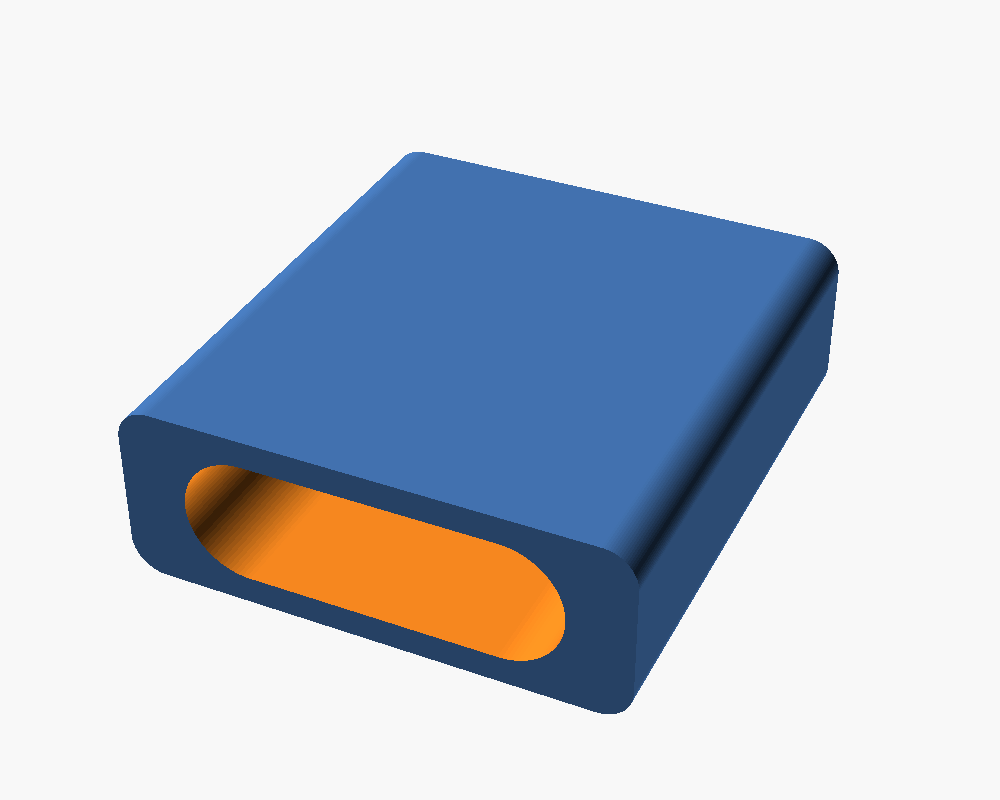
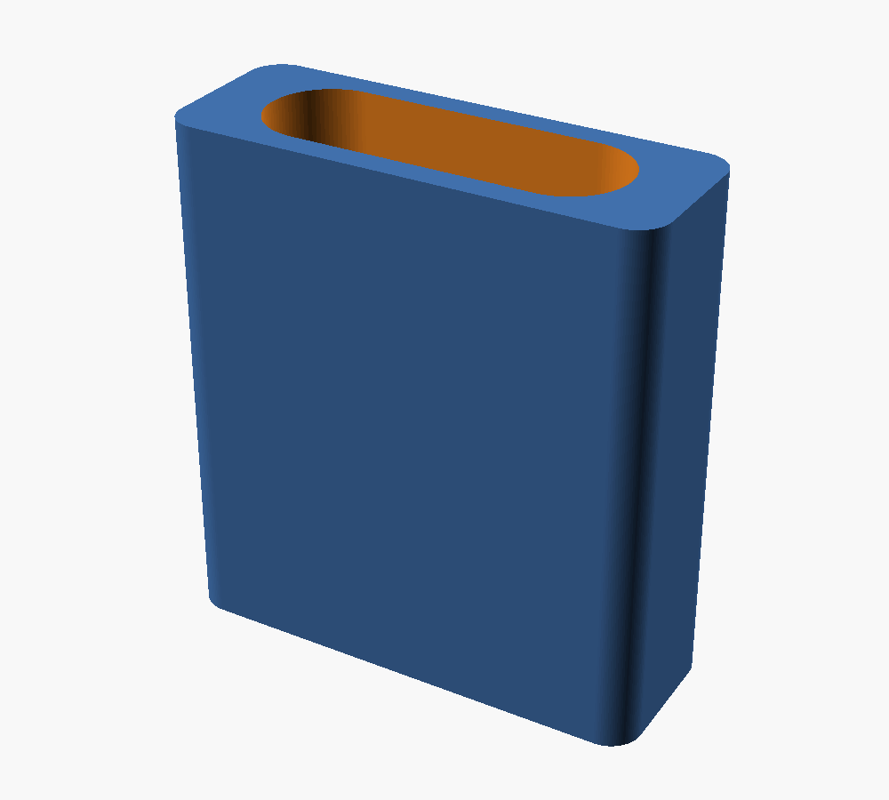

# USB-A → USB-C storage adapter

A parametric solid block, shaped on the outside like a USB-A plug and
hollowed inside to the shape of a USB-C plug. Push it into a USB-A storage
slot to turn that slot into one that holds a USB-C drive. Friction-fit,
no flange, matches the form factor of a regular USB-A plug.

Self-contained `.scad` — no library dependencies. Open in OpenSCAD
(Window → Customizer) to tweak, or slice the included STL directly.

## Files

| File | Purpose |
|------|---------|
| `usb-a-to-c-storage-adapter.scad` | Parametric source — edit this. |
| `exports/usb-a-to-c-storage-adapter.stl` | Pre-rendered STL at default parameters. |
| `exports/usb-a-to-c-storage-adapter.3mf` | Same, 3MF format. |
| `preview/render-perspective.png` | In-use view. |
| `preview/render-print-layout.png` | Build-plate orientation. |

## Tuneables

All parameters exposed through OpenSCAD's Customizer.

### Outer shell (USB-A side)

| Parameter | Default | Notes |
|---|---|---|
| `usb_a_width` | `12.0` | Long-axis width. |
| `usb_a_height` | `4.5` | Short-axis height. |
| `block_length` | `12.7` | Total block length. |
| `outer_clearance` | `0.25` | Subtracted from outer dims. Bump up if too tight. |
| `outer_corner_r` | `0.8` | Outer profile corner radius. |

### Inner pocket (USB-C side)

| Parameter | Default | Notes |
|---|---|---|
| `usb_c_width` | `8.4` | Long-axis width. |
| `usb_c_height` | `2.6` | Short-axis height. |
| `pocket_clearance` | `0.35` | Added to pocket dims. Bump up if drive scrapes. |

### Pocket depth

| Parameter | Default | Notes |
|---|---|---|
| `through_hole` | `true` | `true` = pocket goes clean through. `false` = blind pocket. |
| `blind_pocket_depth` | `7.5` | Used when `through_hole = false`. |
| `blind_back_wall` | `1.2` | Wall thickness at closed end. |

### Quality / layout

| Parameter | Default | Notes |
|---|---|---|
| `$fn` | `96` | Facet count on rounded corners. |
| `print_orientation` | `true` | `true` = upright on build plate. |

## Print settings

Default orientation stands the part on the closed end of the USB-A
profile, pocket opening facing up. No supports needed.

| Setting | Recommendation |
|---|---|
| Layer height | 0.2 mm fine; 0.16 mm cleaner pocket walls |
| Wall loops | 3+ — pocket walls are ~1 mm, want them solid perimeter |
| Supports | None |
| Brim | Recommended — contact patch is only ~12 × 4.5 mm |
| Material | PLA or PETG; PETG more durable for repeated insertion |

## Tuning the fit

USB-A storage hole sizes vary. Print one, check it, adjust:

- **Loose in the hole** → reduce `outer_clearance`, or bump `usb_a_width` /
  `usb_a_height` by 0.1–0.2 mm.
- **Won't go in** → increase `outer_clearance` by 0.1 mm at a time.
- **USB-C drive tight** → increase `pocket_clearance` by 0.1 mm.
- **USB-C drive loose** → reduce `pocket_clearance`.

## Comparison vs. existing Printables models

### [usb-A to usb-C converter](https://www.printables.com/model/782469-usb-a-to-usb-c-converter) — Deadhead Surfer (Feb 2024)

STL only, fixed 12.7 mm tall. Author's own description: *"Loose fit in
usb-a, glued them in with CA glue. Usb-c is a snug fit!"* — the outer fit
didn't work for them and needed adhesive.

**vs. this**: same form factor, but parametric — adjust `outer_clearance`
and reprint instead of reaching for the CA. Adjustable USB-C clearance too.

### [USB A to C insert](https://www.printables.com/model/195160-usb-a-to-c-insert) — Enwewn

STL + PDF, CC BY 4.0. No parametric source.

**vs. this**: same fixed-STL limitation. This file ships the `.scad`, so
every dimension is a one-line edit.

### Summary

| | Deadhead Surfer | Enwewn | **This design** |
|---|:-:|:-:|:-:|
| Parametric source (`.scad`) | — | — | **✓** |
| Adjustable outer/inner clearance | — | — | **✓** |
| Adjustable block length | — | — | **✓** |
| Optional through-hole | — | — | **✓** |
| Ready-to-slice STL | ✓ | ✓ | ✓ |

If you want a print-and-go file for a standard rack, any of the three
works. If your rack or drive is non-standard, this is the only one you
can dial in without re-modelling.

## License

Released under the same terms as the rest of this repository.
