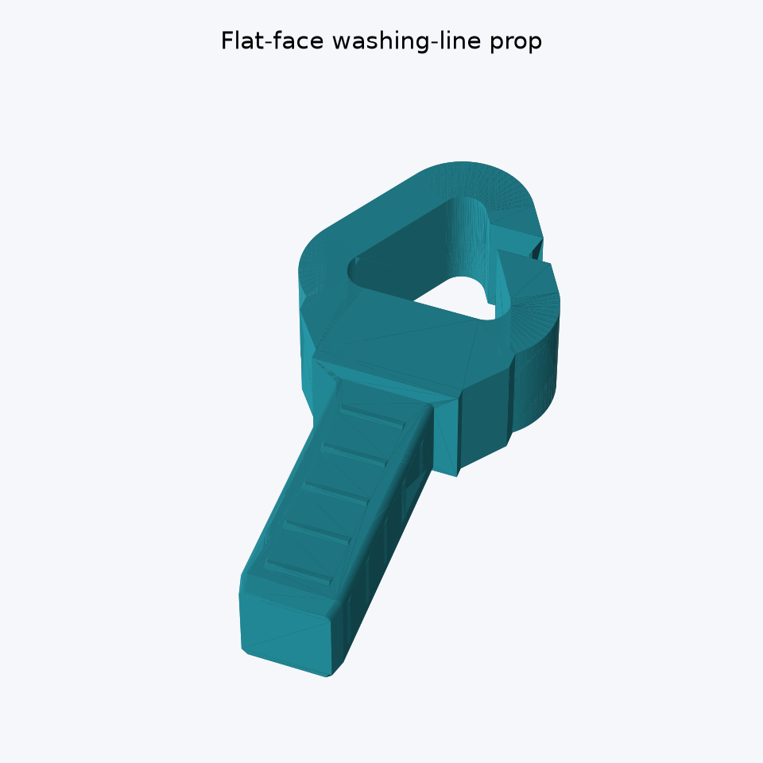

# Washing-line prop head

One-piece PETG replacement for a hollow square metal washing-line prop with a
**17 × 17 mm internal bore**. A solid square plug carries adjustable crush ribs;
a shoulder bears on the pole rim. A broad solid neck supports a rounded triangular
hoop with a high side entry, keeping the bottom line seat continuous.



Preview shows the optional flat-face version; the current source and exports use
the supported version (`flat_print_face = false`).

Open [washing-line-prop.scad](washing-line-prop.scad) in OpenSCAD and use Customizer.
No external libraries. Ready-to-slice defaults:

- [Complete head](exports/washing-line-prop.stl)
- [Plug fit test with solid plier-grip block](exports/fit-test.stl)
- [Complete head — slicer project](exports/washing-line-prop.3mf)
- [Fit test — slicer project](exports/washing-line-prop-fit-test.3mf)

The generated complete-head project embeds **4 wall loops, 30% gyroid sparse infill, 6 top/bottom
layers, 0.20 mm layers and Hybrid automatic tree supports**. They target an **A1 mini with a
0.4 mm nozzle, Generic PETG and Textured PEI Plate**, following the repository's
existing printer convention. Select your actual printer, filament and plate if
different, and retain the custom process settings. Open them **as projects** in
Bambu Studio / OrcaSlicer, rather than importing only their geometry.

OpenSCAD's own 3MF export contains geometry, not these slicer settings. Re-exporting
over a project from OpenSCAD will lose the settings. To update dimensions, export
an STL and replace the model inside the saved slicer project, then save the project.
A separate [process preset](print-profile.json) is included for reuse.

## Dimensions and fit

All dimensions are millimetres. The square bore dimension is measured across its
flats, not diagonally. Defaults are a starting point, not a guaranteed press fit.

| Parameter | Default | Meaning |
|---|---:|---|
| `pole_inside` | 17 | Internal square width |
| `fit_clearance` | 0.20 | Total width removed from the plug core; 0.10 per side |
| `plug_depth` | 45 | Insertion length below shoulder |
| `plug_corner_radius` | 1 | Rounded plug corners; increase for rounded tube interiors |
| `tip_length` / `tip_chamfer` | 3 / 0.8 | Lead-in length / reduction per side at tip |
| `rib_count` | 5 | Ribs per face; three faces in flat mode, four otherwise |
| `rib_height` | 0.20 | Projection from core per face |
| `rib_width` | 1.8 | Rib width along insertion direction |
| `rib_face_fraction` | 0.65 | Fraction of flat covered by each rib |
| `rib_end_margin` | 5 | Clear distance at each end before ribs start |
| `shoulder_width` / `shoulder_height` | 25 / 5 | Stop width / height along pole |
| `head_thickness` | 20 | Thickness through the hoop and shoulder |
| `neck_width` | 22 | Width of solid connection at shoulder |
| `opening_width` / `opening_height` | 28 / 25 | Clear triangular opening's bounding dimensions |
| `opening_corner_radius` | 4 | Rounding of opening vertices |
| `hoop_wall` | 8 | In-plane material around opening |
| `seat_height` | 12 | Shoulder top to bottom of line opening |
| `entry_gap` | 5 | Vertical clearance of side slot; set 0 for a closed hoop |
| `entry_position` | 0.72 | Slot height as a fraction of opening height |
| `part` | `complete` | Select `fit_test` for the fit coupon |
| `print_orientation` | `true` | Hoop lies parallel to bed; false displays upright |
| `flat_print_face` | `false` | Common flat bed face, no underside ribs, flat-bottomed tip |
| `grip_width` / `grip_length` | 10 / 15 | Fit-test grip width / extension beyond shoulder |
| `grip_extra_height` | 2 | Fit-test grip rise above shoulder in print orientation |

Default core is **16.8 mm** across flats. Side rib peaks are **17.2 mm**, giving nominal
interference of **0.10 mm per side** in a 17 mm bore. In flat mode the vertical span
is **17.0 mm** (one ribbed face); the opposing side ribs provide the interference:

```
core = pole_inside - fit_clearance
rib peaks = core + 2 * rib_height
flat mode vertical span = core + rib_height
interference per side = rib_height - fit_clearance / 2
```

Print the fit test first with the same material, orientation and settings as the
final part. Remove supports and any first-layer flare. Try insertion by hand;
do not hammer it into the tube. If only the ribs are tight, reduce `rib_height`
in 0.05 mm steps. If the core binds, increase `fit_clearance` in 0.10 mm steps;
check the tube's rounded corners and internal weld seam. If loose, increase
`rib_height` in 0.05 mm steps. Zero rib height or count disables ribs. A positive
clearance with ribs disabled produces a clearance fit.

The fit test replaces the hoop with a **solid 10 × 15 mm plier-grip block**,
22 mm tall from the print bed (2 mm above the shoulder). Its flat underside
prints on the bed and its base joins the shoulder across the full head thickness.
Grip this block to pull the test plug straight out; avoid levering against the
metal rim. It sits entirely outside the insertion portion and does not alter fit.

Measure the pole outside too: the shoulder's **25 × 20 mm** cross-section must
overhang the metal rim on its bearing sides. In flat mode it bears on three sides;
the bed-facing side is flush with the plug. Normal mode has a centred shoulder
that can bear on all four sides. Increase `shoulder_width` and
`head_thickness` if necessary. A wider bore may also require increasing
`neck_width` and these shoulder dimensions; assertions explain invalid settings.

Choose an entry gap just larger than the actual line diameter (5 mm is a starting
point for a roughly 4 mm line). Do not force the printed arms apart to admit the
line. The slot is open, so it is not a locking clip: slack or sideways movement
can allow the line to escape. The normal load should press the line onto the
continuous bottom seat, with the hoop plane aligned to the expected sideways pull.

## Saved support setup

`washing-line-prop-fit-test.3mf` is the user's saved Bambu reference project and
is preserved unchanged. Its support mode is **Tree (auto), Hybrid style**. The
model JSON now captures its support geometry settings, including the 30-degree
threshold, 0.2 mm top/bottom Z gaps, 0.35 mm XY clearance, two top/bottom interface
layers and 0.5 mm interface spacing. Supports are not restricted to the build plate.
The complete-head source currently uses the original supported orientation.

One cross-slicer difference: Bambu uses **-1** for automatic support walls, while
Orca uses **0**. The JSON uses Orca's value so CLI verification works. **When opening
the generated project in Bambu Studio, select Auto for support wall loops** to
match the reference (Bambu interprets 0 differently). See
[Bambu's setting definition](https://github.com/bambulab/BambuStudio/blob/master/src/libslic3r/PrintConfig.cpp)
and [Orca's support documentation](https://github.com/OrcaSlicer/OrcaSlicer/wiki/support_settings_advanced).
Slicer implementations may generate different support paths even with equivalent
settings. The reference also uses grid infill and 5/3 top/bottom layers; only its
support setup was copied, retaining our 30% gyroid and 6/6 shell layers.

## PETG printing and strength

This design uses a thick hoop, rounded opening, wide neck, solid plug and shoulder
load path. It has not been physically load-tested and has no assigned load rating.
Actual strength depends on filament, bonding, print defects, temperature, creep
and load direction, including wind and wet washing.

Starting settings for a 0.4 mm nozzle:

- Keep the supplied sideways orientation: pole axis and hoop outline lie in the
  XY plane. Do not stand it on the plug tip; that puts the neck across layer bonds.
- The requested project settings are **4 wall loops, 30% gyroid infill and
  6 top/bottom layers**, at 0.20 mm layers. These supersede the initial solid-print
  suggestion; the printed plug, head and grip will have sparse interiors. Inspect
  the sliced neck and seat and physically test the part under increasing load.
- With **`flat_print_face = true`**, use **no supports**. Plug, lead-in, shoulder,
  head and grip share Z=0. Lower plug corners and side rib ends have 45-degree
  bevels. The full plug core width and head thickness are retained; the head is
  offset through its thickness relative to the plug. Check the sliced preview,
  especially if increasing rib height, and compensate first-layer flare for fit.
- With `flat_print_face = false`, enable **build-plate supports underneath the
  plug and lower ribs**. The core underside is then 1.6 mm above the bed with these
  dimensions. Use the same flat-face option for the fit test and complete head.
- Use a calibrated PETG profile for your actual filament and printer, with dry
  filament and sufficient bonding. Avoid excessive cooling of structural walls.
- Remove support remnants carefully, retaining the ribs; smooth the line-contact
  surfaces and entry lips so they cannot abrade the washing line.

PETG is used for mechanical holders and clamps and has good layer adhesion; see
[Prusa's PETG material guidance](https://help.prusa3d.com/article/petg_2059).
The settings above are proposed starting settings for this model, not validated
strength data. After fitting, apply load progressively close to the ground and
check for rocking, cracking or permanent bending. Recheck after sustained loading
and outdoor use. Increase dimensions or revise the design if it deforms; infill
alone cannot correct a poor load path or weak layer bonding.

## Export

Use the shared exporter to embed this model's **4 walls, 30% gyroid and Hybrid automatic tree
supports**, configured in [3mf-settings.json](3mf-settings.json):

```sh
# From the repository root:
python scripts/export-3mf.py models/washing-line-prop/washing-line-prop.scad -D 'part="complete"'
python scripts/export-3mf.py models/washing-line-prop/washing-line-prop.scad -D 'part="fit_test"' -o models/washing-line-prop/exports/washing-line-prop-fit-test.3mf
```

See [exporter instructions](../../scripts/README.md). Geometry-only STL export
(run from this model directory):

```sh
openscad -D 'part="complete"' -o exports/washing-line-prop.stl washing-line-prop.scad
openscad -D 'part="fit_test"' -o exports/fit-test.stl washing-line-prop.scad
```

Regenerate the STL after any parameter changes. The supplied exports use the current dimensions, selecting each part explicitly.
The source is currently set to show the complete head, with `flat_print_face = false`.
